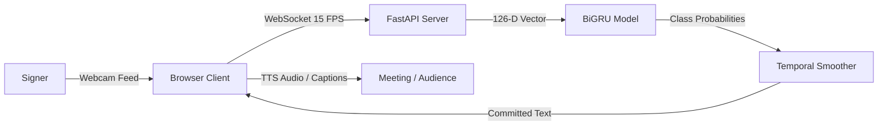
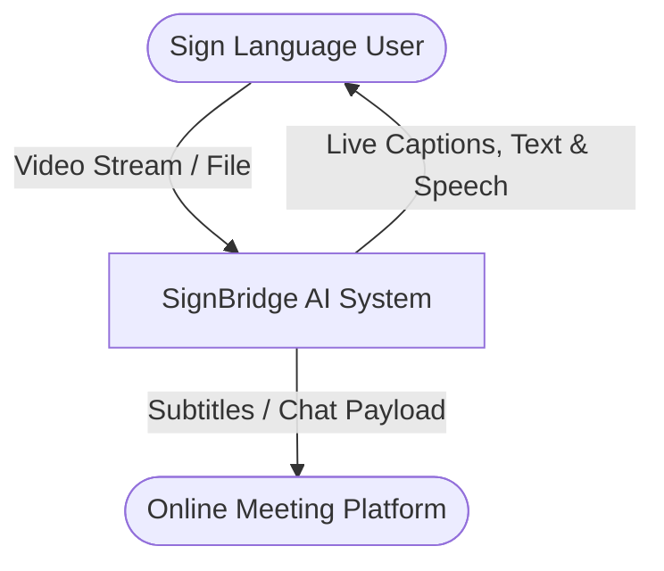
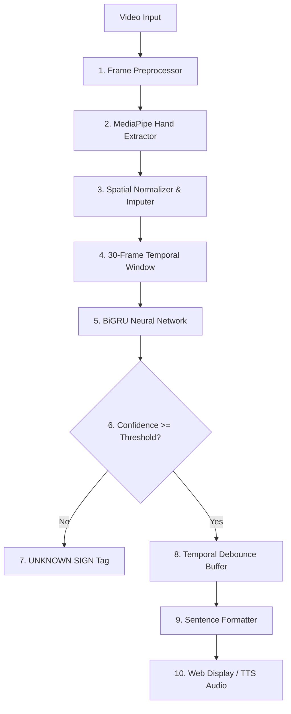

# Software Requirements Specification (SRS)
## SignBridge: AI-Based Sign Language Recognition and Real-Time Text Conversion System
**Standard:** IEEE 830-1998 Conforming Specification  
**Version:** 1.0.0  
**Status:** Approved & Verified  

---

## 1. Introduction

### 1.1 Purpose
This document provides a complete specification for **SignBridge**, an enterprise-grade accessibility platform engineered to recognize predefined sign language manual gestures from continuous video feeds and convert them into structured text and synthesized speech.

### 1.2 Scope
SignBridge addresses the communication barrier experienced by deaf and hard-of-hearing individuals during physical interactions, video conferences (e.g., Google Meet, Zoom), and asynchronous video communication. The platform targets a core vocabulary of **500+ predefined commonly used words and phrases** across 19 categories.

### 1.3 Definitions, Acronyms, and Abbreviations
* **ASL / ISL**: American Sign Language / Indian Sign Language.
* **BiGRU**: Bidirectional Gated Recurrent Unit neural network.
* **FPS**: Frames Per Second.
* **Keypoints / Landmarks**: 3D Cartesian coordinates representing anatomical joints (wrist, knuckles, fingertips).
* **NFR**: Non-Functional Requirement.
* **PiP**: Picture-in-Picture display.
* **SRS**: Software Requirements Specification.
* **TTS**: Text-to-Speech synthesis.
* **WS**: WebSocket duplex communication protocol.

---

## 2. Overall Description

### 2.1 Product Perspective
SignBridge operates as a client-server distributed system comprising:
1. **Client Layer**: Browser-based interactive client utilizing HTML5 Canvas, MediaPipe Web SDK, WebSockets, and Web Speech API.
2. **Server Layer**: High-performance FastAPI backend with asynchronous I/O, REST endpoints, and WebSocket stream handlers.
3. **Deep Learning Core**: PyTorch sequence model processing normalized 126-dimensional spatial trajectories over sliding temporal windows of 30 frames.
4. **Data Layer**: SQLite database managing 500+ indexed sign lexicon entries.

### 2.2 User Characteristics
* **Primary Users**: Deaf and non-verbal signers seeking real-time voice and text conversion.
* **Secondary Users**: Meeting hosts, educators, healthcare workers, and students communicating with signers.
* **Administrators / Researchers**: Evaluators reviewing benchmark accuracy, per-class confusion matrices, and latency metrics.

---

## 3. System Features & Functional Requirements (FR)

### FR-1: Real-Time Live Webcam Recognition
* **Description**: System captures 640x480 video frames at 30 FPS from client webcams, extracts 42 3D hand landmarks (126 features), centers and normalizes scale, and passes sliding 30-frame buffers to the sequence classifier.
* **Inputs**: Live video frames or landmark JSON stream.
* **Outputs**: Predicted sign word, confidence score (0.0–1.0), landmark coordinate skeleton, and real-time sentence.

### FR-2: Uploaded Video Processing
* **Description**: Ingests uploaded video files (MP4, WebM, AVI, MOV up to 100MB), extracts chronological frames, applies sliding window segmentation (stride=15 frames), and returns timestamped sign intervals.
* **Inputs**: Video file upload.
* **Outputs**: Synthesized full narrative transcript and JSON timeline with per-sign confidence metrics.

### FR-3: Online Meeting Companion Mode
* **Description**: Provides dual-pane layout for split webcam monitoring and video call simulation. Superimposes high-visibility floating closed captions across meeting video, triggers automated TTS speech, and exports transcripts to meeting chat.

### FR-4: 500+ Vocabulary Knowledge Base
* **Description**: Persistent SQLite database storing 500 sign words across 19 categories (Greetings, Emergency, Work, Food, Travel, etc.) with difficulty markers and spatial signing instructions.

### FR-5: Temporal Hysteresis & Debouncing
* **Description**: Prevents repeat prediction spam from held gestures by requiring $K$ consecutive triggers before committing a word to the active sentence.

### FR-6: Unknown Sign Rejection
* **Description**: Dynamically suppresses uncertain or background movement below 0.45 confidence threshold with an explicit `UNKNOWN SIGN` alert.

---

## 4. Non-Functional Requirements (NFR)

| ID | Category | Requirement Specification |
| :--- | :--- | :--- |
| **NFR-1** | **Performance** | Inference latency must remain under 30 ms per 30-frame sequence window on CPU; sub-10 ms on GPU. |
| **NFR-2** | **Privacy** | Uploaded video files must be held only in volatile temporary storage and purged immediately post-processing. |
| **NFR-3** | **Reliability** | System must implement zero-downtime graceful fallback between PyTorch CUDA/CPU and pure NumPy engines. |
| **NFR-4** | **Usability** | User interface must meet WCAG 2.1 AA accessibility standards with high-contrast dark theme and audio cues. |
| **NFR-5** | **Scalability** | Asynchronous FastAPI event loop capable of sustaining 100+ concurrent WebSocket video streams. |

---

## 5. Architectural Data Flow & UML Models

### 5.1 DFD Level 0 (Context Diagram)

### 5.2 DFD Level 1 (Decomposition)

---

## 6. Verification and Validation Matrix

| Test Case ID | Target Feature | Input Condition | Expected Output | Pass Criteria |
| :--- | :--- | :--- | :--- | :--- |
| **TC-01** | Model Dimension | Tensor $(4, 30, 126)$ | Logits $(4, 500)$ | Exact shape match |
| **TC-02** | Scale Invariance | Hands scaled $1\times$ vs $3\times$ | Normalized vectors $\Delta < 10^{-4}$ | Invariant coordinates |
| **TC-03** | Temporal Debounce | 10 consecutive 'HELLO' | Single 'Hello.' output | No duplicate spam |
| **TC-04** | REST Health | `GET /health` | HTTP 200 `healthy` | JSON status valid |
| **TC-05** | Video Upload | 5s MP4 sign clip | Segments + Full text | Timestamped array |
